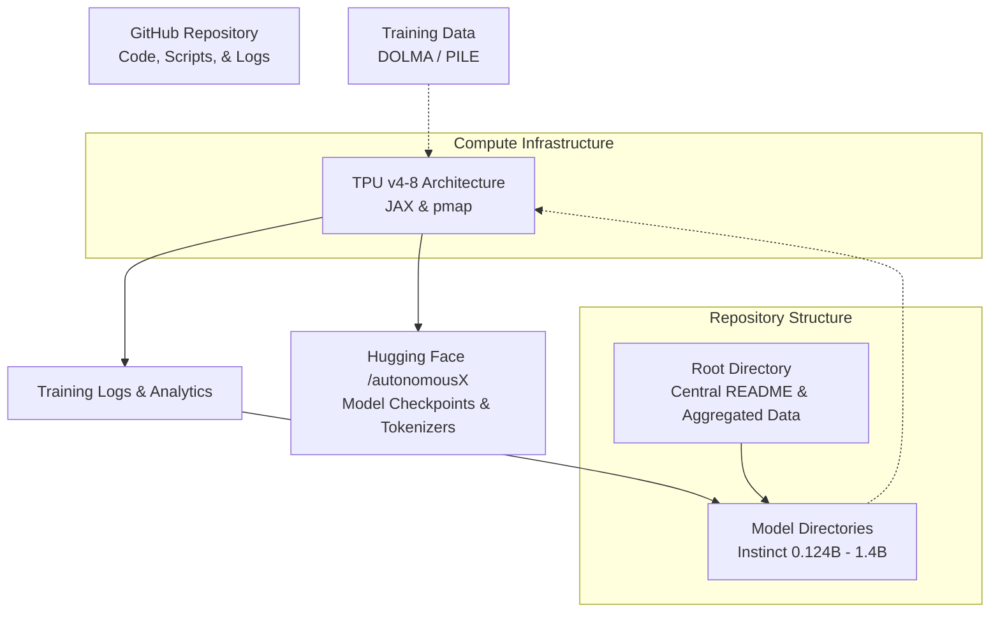
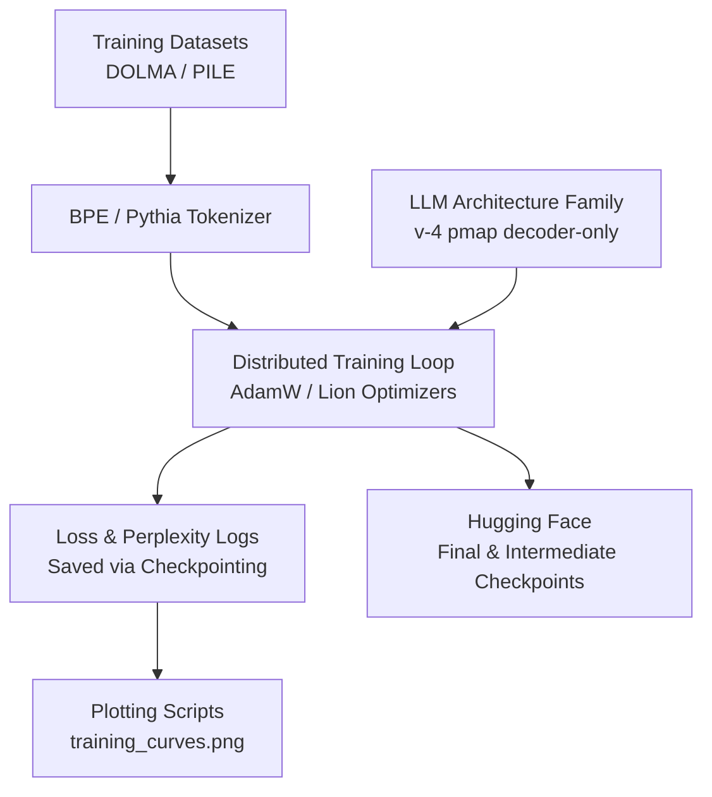

# AutonomousX: Instinct Model Family

**[autonomousX on Hugging Face](https://huggingface.co/autonomousX)**

**[Training scripts and Logs on GITHUB](https://github.com/YADAV1825/AutonomousX-Instinct)**


AutonomousX is an ambitious open-source project by **Rohit Yadav** where a complete family of Large Language Models (LLMs) was built entirely from scratch. 

This repository tracks the training logs, model architectures, and analytics for various LLM parameter sizes, ensuring a highly documented, educational, and reproducible process for understanding how language models scale.

---

### 👨‍💻 Author Information
**Rohit Yadav** B.Tech 3rd Year  
Dr. B.R. Ambedkar National Institute of Technology (NIT) Jalandhar, India  
**E-mail:** [yrohit1825@gmail.com](mailto:yrohit1825@gmail.com)  
**LinkedIn:** [Rohit Yadav](https://www.linkedin.com/in/rohit-yadav-25535b256/)  
**GitHub:** [YADAV1825](https://github.com/YADAV1825)

**Research interests include:** Large Language Models, MultiModal Pipelines, Systems Programming, AI Infrastructure, Distributed Training.

---

## 🚀 About AutonomousX

AutonomousX focuses on open-source contributions aimed at building Large Language Models from scratch using custom training pipelines. Our work explores different training configurations including optimizers, datasets, and scalable TPU training using JAX and pmap. The goal is to provide transparent and reproducible implementations so that researchers, students, and developers can understand how modern LLMs are trained end-to-end.

Due to the current scarcity of complete beginner-friendly guides for training LLMs on TPUs, especially using JAX, AutonomousX aims to bridge this gap by publishing full training pipelines, scripts, and documentation for the open-source community.

---

## 📊 Model Family Overview

The project successfully trained multiple models ranging from 124 million to 1.4 billion parameters, trained on massive datasets like DOLMA and PILE. 

Below is the detailed list of models, architecture setups, and their respective checkpoints:

| Model | Params | Architecture | Positional Embeddings | Optimizer | Dataset | Checkpoints on Billions Tokens | Total Tokens |
| :--- | :--- | :--- | :--- | :--- | :--- | :--- | :--- |
| **Instinct 0.124B** | 124m | v-4 (128) pmap | RoPE | AdamW | DOLMA | 6B, 12B, 18B, 25B | 25B tokens |
| **Instinct 0.3B** | 300m | v-4 (128) pmap | RoPE | AdamW | DOLMA | 6B, 12B, 18B, 24B, 30B | 30B tokens |
| **Instinct 0.5B** | 0.5B | v-4 (128) pmap | RoPE | AdamW | PILE | 40B, 80B, 120B, 150B | 150B tokens |
| **Instinct 0.65B** | 0.65B | v-4 (128) pmap | RoPE | AdamW | DOLMA | 25B, 50B, 75B, 100B | 100B tokens |
| **Instinct 1B** | 1B | v-4 (128) pmap | No RoPE | AdamW | PILE | 20B, 40B, 60B, 80B, 85B | 85B tokens |
| **Instinct 1.4B** | 1.4B | v-4 (128) pmap | RoPE | Lion | DOLMA | 26B, 52B, 70B | 70B tokens |

*(Note: 150m models are currently excluded from this release tracking.)*

---

## 🗂️ Repository Structure

The repository is organized into specific directories for each parameter scale of the Instinct model family. Each directory contains the specific training logs, perplexity validations, inference scripts (`train.py`), and a dedicated `README.md` with deep-dives into their learning curves.

```text
.
├── Instinct 0.124B
│   ├── README.md               # Detailed architecture and logs for 124M model
│   ├── training_curves.png     # Visualized loss curves
│   ├── training_log_120.txt    # Raw training log
│   ├── train.py                # Source code and inference script
│   └── val_perplexity_120.txt  # Raw perplexity logs
├── Instinct 0.3B
│   ├── README.md
│   ├── training_curves.png
│   ├── training_log_150.txt
│   ├── train.py
│   └── val_perplexity_150.txt
├── Instinct 0.5B
│   ├── README.md
│   ├── training_curves.png
│   ├── training_log.txt
│   ├── train.py
│   └── val_perplexity.txt
├── Instinct 0.65B
│   ├── README.md
│   ├── training_curves.png
│   ├── training_log.txt
│   ├── train.py
│   └── val_perplexity.txt
├── Instinct 1B
│   ├── README.md
│   ├── training_curves.png
│   ├── training_log.txt
│   ├── train.py
│   └── val_perplexity.txt
└── Instinct 1.4B
    ├── README.md
    ├── training_curves.png
    ├── training_log.txt
    ├── train.py
    └── val_perplexity.txt
```

---

## 🔄 Project Architecture & Workflow

The architecture of the entire repository and the associated workflows can be broken down into Data, Core Pipeline, Logging, and Release.

### High-Level System Architecture



### Detailed Training Workflow

The training workflow employed across these architectures follows a modern and optimized deep learning pipeline, scalable across multiple token checkpoints.



---

## 🔗 Checkpoints & Inference

Each sub-directory contains its respective `training_log.txt` and python scripts used to visualize learning progress. 
Checkpoints and model weights are publicly available on Hugging Face at [autonomousX](https://huggingface.co/autonomousX).

Navigate to the individual model directories to see detailed parameter configurations and deep-dives into their learning curves:

- [124m Model](Instinct%200.124B/README.md)
- [300m Model](Instinct%200.3B/README.md)
- [0.5B Model](Instinct%200.5B/README.md)
- [0.65B Model](Instinct%200.65B/README.md)
- [1B Model](Instinct%201B/README.md)
- [1.4B Model](Instinct%201.4B/README.md)
